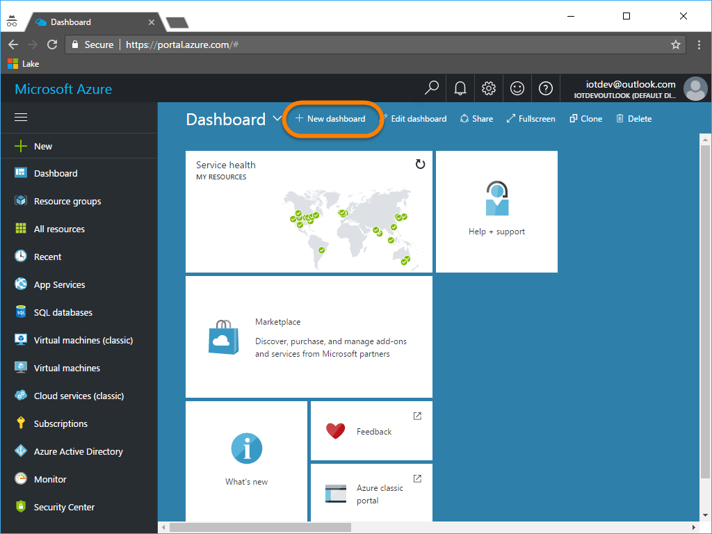

# Azure Prep

**_This is part of the <a target="_blank" href="http://aka.ms/aziot-huzesp-tut">"Azure IoT Adafruit Feather Huzzah ESP8266 Starter Kit Getting Started Tutorial"</a>. If you are coming into this task from somewhere else, you should <a target="_blank" href="http://aka.ms/aziot-huzesp-tut">start at the beginning</a>!_**

---

<a name="overview"></a>

## Overview

Throughout this tutorial, you will be creating a number of resources in Azure.  To help you manage the multiple resources, as well as to make it easy to clean up and delete those resources when you are done you should follow these steps:

1. [Choose a Good Name for your Resources](#goodname)
1. [Choose and Use a Single "Location"](#location)
1. [Create a Portal Dashboard for your Resources](#dashboard)
1. [Create and Use a Single Resource Group](#resourcegroup)


---
<a name="goodname"></a>

## Choose a Good Name for your Resources

The solution that you develop throughout this tutorial looks like this:


If you look at the diagram above, you will see a number of resources that have names that match the "**`<name>xxxx`**" pattern.  These names are made up of a "**`<name>`**" prefix, and some resource type "**`xxxx`**" .  For example, "**`<name>group`**", "**`<name>iothub`**", "**`<name>asajob`**", "**`<name>storage`**" , etc.  It is **_strongly recommended that you conform to this naming convention as you work through this tutorial_**.  It will help you to understand what resources are being referred to in the documentation as well as help you to identify what each resource is when you see it in the portal, etc.

To use this naming convention though, you need to come up with a good "**`<name>`**" prefix for your resource names.  The "**`<name>`**" prefix you choose:

- Must be all lower case - some of the services, like Azure Storage Accounts, require their names to be all lower case.  To conform you should just user lower case in all instances.
- Must be alpha-numeric only, and start with a letter (no special characters, spaces, underlines, dashes, etc). These names are often used to make DNS Fully Qualified Domain Names (FQDN)s.  And as such your name should conform to DNS naming rules.


Following are some possible suggestions of how to come up with your own "**`<name>`**" prefix:

- A lower case single word version of your team name at a hackathon  For example if your team name was "iSaveWater", you might use "**`isavewater`**" as your "**`<name>`**".  Then your resource names would look something like  "**`isavewatergroup`**", "**`isavewateriothub`**", "**`isavewaterasajob`**", etc.
- Your first, middle and last initials along with your birth month and day in MMDD format.  For example, if your name were Jane Q. Doe and you were born of February 17th, you might use "**`jqd0217`**" as your "**`<name>`**" and have resource names like "**`jqd0217group`**", "**`jqd0217iothub`**", "**`jqd0217asajob`**", etc.

For the purposes of this tutorial we'll use "**`ahgst`**" short for "**A**"dafruit "**H**"uzzah "**G**"etting "**S**"tarted "**T**"utorial as the sample "**`<name>`**" prefix. **DO NOT USE "_`ahgst`_" yourself!**

1. Use the information above to come up with a good name prefix
1. Open the folder where you extracted the repository for this tutorial to in Visual Studio Code, then open the "**`myresources.txt`**" file.

    

1. In the "**`myresources.txt`**" file, under the "**`Naming Convetion, Region & Group`**" header, find the "**`Naming convention prefix`**" and replace the "**`<paste your name prefix here>`**" place holder with the name prefix you selected above selected and save your changes.  For example, using our  "**`ahgst`**"  sample prefix, we would change:

    > **Note**: We'll use the "**`myresources.txt`**" file repeatedly throughout this tutorial to keep track of the resources and key peices of information we need.

    ```text
    Use this file to keep track of the resources, ids, connection strings, access tokens, etc. for the various resources you are create throughout this lab.

    ========================================
    Naming Convention, Region & Group 
    ========================================

    Naming convention prefix:
    <paste your name prefix here>

    ...
    ```

    to:

    ```text
    Use this file to keep track of the resources, ids, connection strings, access tokens, etc. for the various resources you are create throughout this lab.

    ========================================
    Naming Convention, Region & Group 
    ========================================

    Naming convention prefix:
    ahgst

    ...
    ```

---

<a name="location"></a>

## Choose and Use a Single "Location"

Azure has multiple data centers or "Location", or "Regions" around the world, and while you CAN create resources in most any data center, you should create the resources closest to where they will be consumed. In addition, when you are using mutiple resources in a single data center, they should all be located in the same data center to help lower latency as well as to eliminate data egress costs as data leaves each data center.

For this tutorial we will be using the following resources:

- Azure IoT Hubs
- Azure Stream Analytics
- Azure Event Hubs
- Azure Storage
- Azure Web Apps
- Azure Function Apps

You can review the <a target="_blank" href="https://azure.microsoft.com/en-us/regions/services/">Products available by region</a> to verify the resources you want to use are available in the data center you choose.

For this tutorial, we will use the "**`westus`**" location.  You can choose to use a different one if you wish.

1. In the "**`myresources.txt`**" file, find the "**`Region (data center):`**" and replace the "**`<paste your region name here>`**" place holder with the location you decided on above and save your changes.  For example, when using the  "**`westus`**"  location, we would change:

    ```text
    ...

    Region (data center):
    <paste your region name here>

    ...
    ```

    to:

    ```text
    ...

    Region (data center):
    westus

    ...
    ```


---

<a name="dashboard"></a>

## Create a Portal Dashboard for your Resources

In these steps, we'll begin preparing the Azure Portal to help us create and manage the resources we need.

1. Open your browser and log in to the <a target="_blank" href="https://portal.azure.com">Azure Portal</a> (<a target="_blank" href="https://portal.azure.com">https://portal.azure.com</a>) using the credentials associated with your Azure Subscription.

1. Along the top of the portal, click **"+New dashboard"**

    > **Note**: You don't have to create a new dashboard, but it's convenient to have all of the resources related to your project on a single page in the portal. 

    

1. Name the dashboard using the "**`<name>`**" prefix you chose above, then click the **"Done customizing"** button.  Here's an example using our "**`ahgst`**" sample prefix:

    

1. You should now see a new empty dashboard ready to hold tiles that reference the resources you create in this tutorial. 

    

---

<a name="resourcegroup"></a>

## Create and Use a Single Resource Group

The final step in this Azure Prep walkthrough is to create the Azure Resource Group that all of the resources in this tutorial will be placed in.

1. With the <a target="_blank" href="https://portal.azure.com">Azure Portal</a> (<a target="_blank" href="https://portal.azure.com">https://portal.azure.com</a>) open in your browser, and the dashboard you created previously opened, click the **"+ New"** button in the top left corner, then scroll down and  select **"Resource Group"**:

    

1. in the **"Resource Group"** blade that opens, complete the fields as follows, and click the **"Create"** button:

    - Resource Group name:  "**`<name>group`**" using the name prefix you selected above
    - Subscription: **Choose the Azure Subscription you want to use** if you have access to multiple subscriptions.
    - Resource group location: **Use the location you chose above**
    - Pin to dashboard: **Checked**

    For example, using the "**`ahgst`**" name prefix and "**`westus`**" loication:

    

1. Once the resource group has been created, it's blade will open in the portal.  You don't need to do anything here, you can click the **"X"** in the top left corner to close it:

    


1. In the "**`myresources.txt`**" file, find the "**`Resource Group Name:`**" and replace the "**`<paste your resource group name here>`**" place holder with the "**`<name>group`**" name you used for your resource group and save your changes.  For example, when using the resource group name "**`ahgstgroup`**", we would change:

    ```text
    ...

    Resource Group Name:
    <paste your resource group name here>

    ...
    ```

    to:

    ```text
    ...

    Resource Group Name:
    ahgstgroup

    ...
    ```


---

<a name="sumnmary"></a>

## Summary and Next Step

In this task, you chose how you were going to name the resources you create in this lab by decided on a "**`<name>`**" prefix, you chose a the Location where all the resources would be created.  Then, in the Azure Portal, you created a new Dashboard to store all the tiles for the resources you create in a convenient place, and finally created an Azure Resource Group in which you will create all the resources.  

Next Step: [Configure the Azure IoT Hub](../02-IoTHub/README.md)


