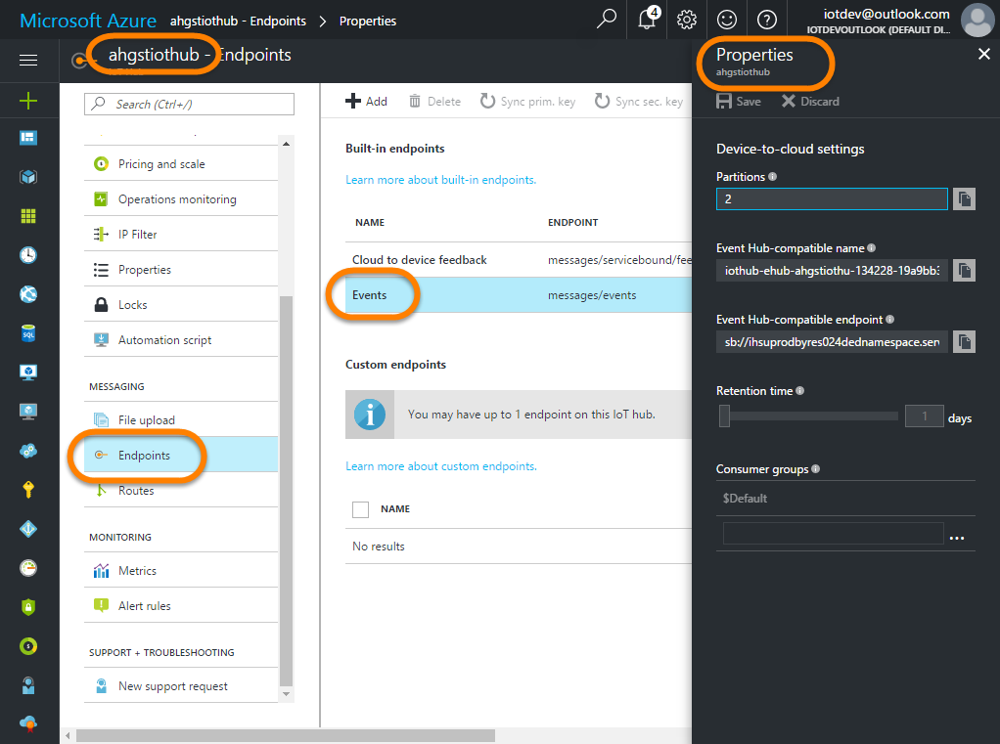
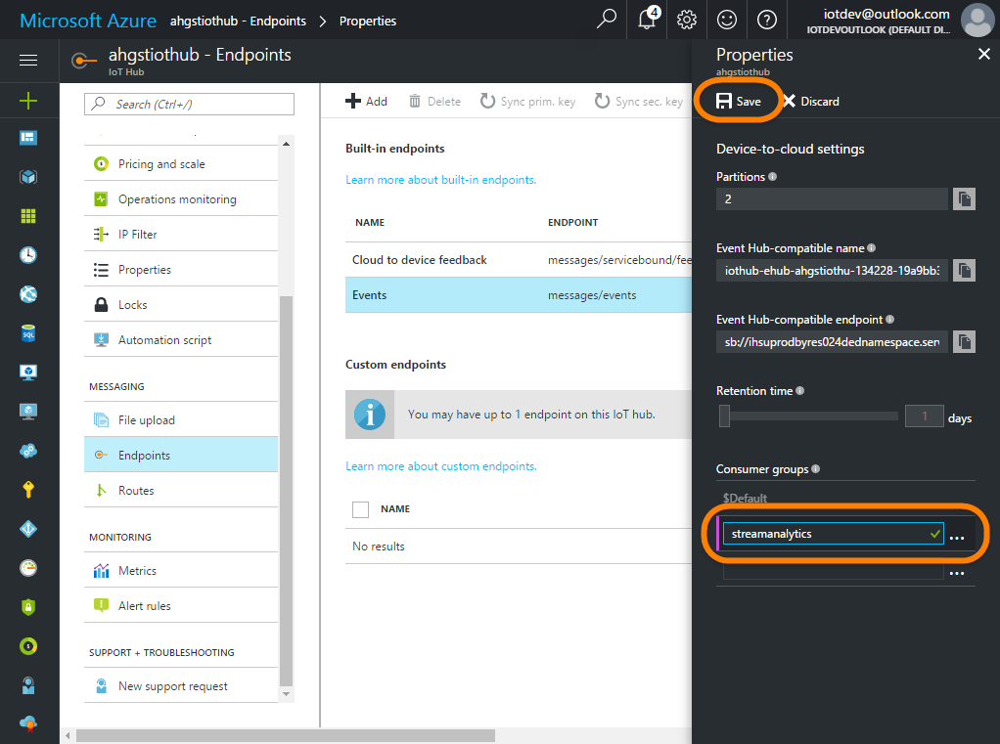

# Configure the Azure IoT Hub
---

<a name="overview"></a>

## Overview

In this task you will create the Azure IoT Hub that we will use to communicate with the Adafruit Huzzah ESP8266 board and DHT22 sensor in the field.  Azure IoT Hubs provide an extermely powerful way to provide two way messaging capabilities with IoT devices in the field.  More than just a messaging platform though, IoT Hubs also provide device management capabilities as well as Field Gateways and Protocol Gateways.  You can learn more about Azure IoT Hubs here: <a target="_blank" href="https://azure.microsoft.com/en-us/services/iot-hub/">https://azure.microsoft.com/en-us/services/iot-hub/</a>

Follow these steps:

1. [Create the Azure IoT Hub](#step1)
1. [Configure the Shared Access Policies](#step2)
1. [Configure the Consumer Groups](#step3)
1. [Create the Device Identity](#step4)

---

<a name="step1"></a>

## Step 1

1. With the <a target="_blank" href="https://portal.azure.com">Azure Portal</a> (<a target="_blank" href="https://portal.azure.com">https://portal.azure.com</a>) open in your browser, and the dashboard you created previously opened, click the **"+ New"** | **"Internet of Things"** | **"IoT Hub"**:

    

1. In the new "**Iot hub"** blade, configure the options as follows, and click the "**Create**" button:

    - Name: "**`<name>iothub`**" using the prefix you selected previously
    - Pricing and scale tier: Click it, and select either **"F1 Free"** (if available) or **"S1 Standard"**.  You can only have a single **"F1 Free"** hub per subscription so if you already have one for another solution you will need to select **"S1 Standard"** here. In addition, if you will be using the hub heavily, the **"F1 Free"** tier usage quotas may be too restrictive. For the purposes of this lab though the free tier should be fine.
    - IoTHub units: **Leave at the default for your pricing tier**
    - Device-to-cloud partitions: **Leave at the default for your pricing tier**
    - Subscription: **Select the subscription you wish to use**
    - Resource Group: Use the exisitng "**`<name>group`**" you created previously
    - Location: **Use the location you decided on previously**
    - Pin to dashboard: **Checked**

    

1. Once the new IoT Hub has been created (it will likely take a few minutes), the blade for it will open up. **Keep the blade open, you will need it in the coming steps**.

    

1. In the "**`myresources.txt`**" file, under the "**`Azure IoT Hub Resources`**" header, find the "**`IoT Hub Name:`**" and replace the "**`<paste your IoT Hub name here>`**" place holder with the name of the IoT Hub you just created and save your changes.  For example, using the IoT Hub name  "**`ahgstiothub`**"  sample prefix, we would change:

    ```text
    ...

    ========================================
    Azure IoT Hub Resources 
    ========================================

    IoT Hub Name:
    <paste your IoT Hub name here>

    ...
    ```

    to:

    ```text
    ...

    ========================================
    Azure IoT Hub Resources 
    ========================================

    IoT Hub Name:
    ahgstiothub

    ...
    ```

---

<a name="step2"></a>

## Configure the Shared Access Policies

Azure IoT Hubs are secure resources, and as such you need to the proper credentials (name & key) with the appropriate permissions to connect to your IoT Hub and interact with it. Your Azure IoT Hub comes with a number of pre-provisioned "Shared Access Policies" (a.k.a. SAS Policies) that serve as those credential and permission specifications.

SAS Policies are made up of three things:

- **The SAS Policy Name**. You can think of this as kind of like a username.
- **The SAS Policy Key**.  You can think of this as kind of like the password.  Although with Shared Access Policies there are actually ***two*** keys, the **Primary Key** and the **Secondary Key**.  Both keys provide identitical access.  The reason for having two is so you can do "rolling key changes" where you use one key for a while, then switch to the other key and regenerate the first one, etc. to help keep them secure.
- **The SAS Policy Permissions**.  These are the permissions that are granted to your connection if you successfully authenticate using the SAS Policy Name and SAS Policy Key.

Each new Azure IoT Hub comes with a number of pre-provisioned SAS policies.  We won't discuss all of them here, but there are two that are of interest:

- "**`iothubowner`**" is the default "**administrative**" policy.  It has ALL permissions granted.

  - It can manage the identities of devices that can connect to the hub
  - It can send and receive messages with devices through the hub
  - It can even act as a device.
  
  You will want to use this policy when you are connecting with tools like "**iothub-explorer**", "**Device Explorer**" to manage the devices in your IoT Hub.

- "**`service`**" is the default "**service application**" policy. Code connecting with this policy doesn't have the permission to manage the hub, but it can:

  - Send and receive messages with devices via the hub via the "cloud-side") endpoints

  This is a good policy to use when you just need to listen for messages coming from devices via the hub, and possibly send message back to the devices.

When connecting to an Azure IoT Hub as an application that hopes to either Manage the IoT Hub itself or act as a backend service that communicates with devices via the IoT Hub, you will need to know three things:

- **The Azure IoT Hub Name** you want to connect to.  For this tutorial, that will be your "**`<name>iothub.azure-devices.net`**
- **The SAS Policy Name** you want to connect as
- **The SAS Policy Key** (either Primary or Secondary will work) for the SAS Policy name you are connecting as.

That Azure IoT SDKs support using "**Connection Strings**" to connect to your IoT Hub.  A connection string is really just the three things you need wrapped up into a single string:

`HostName=`**`<IoT Hub Name>.azure-devices.net`**`;SharedAccessKeyName=`**`<SAS Policy Name>`**`;SharedAccessKey=`**`<SAS Policy Key>`**

You can see from above that a connection string is a convenient way to wrap up everything you need to successfully connect to an Azure IoT Hub in a single convenient value.

In this step, you'll document that "**`iothubowner`**" and "**`service`**" SAS policy connection strings for later use.

1. Back in the Azure Portal, the blade for your IoT Hub should be open from the previous step (if not, open it), then along the left click on "**Shared access policies"** | "**iothubowner**" and click the icon to the right of the "**Connection string-primary key**" to copy the connection string for this "**iothubowner**" policy to your clipboard:

    

1. In the "**`myresources.txt`**" file, find the "**`IoT Hub "iothubowner" SAS Policy Primary Connection String:`**" and replace the "**`<paste your IoT Hub "iothubowner" sas policy connection string here Hub name here>`**" place holder with the iothubowner connection string you just copied.  For example, Change:

    ```text
    ...

    IoT Hub "iothubowner" SAS Policy Primary Connection String:
    <paste your IoT Hub "iothubowner" sas policy connection string here Hub name here>

    ...
    ```

    to:

    ```text
    ...

    IoT Hub "iothubowner" SAS Policy Primary Connection String:
    HostName=ahgstiothub.azure-devices.net;SharedAccessKeyName=iothubowner;SharedAccessKey=c/d0U2BeW6tTEdlAahcYsO0MLsgIiXa2MBeUnNp/z6o=

    ...
    ```

1. Repeat the process by copying the connection string for the "**service**" SAS Policy:

    

1. Then in the "**`myresources.txt`**" file, find the "**`IoT Hub "service" SAS Policy Primary Connection String:`**" and replace the "**`<paste your IoT Hub "service" sas policy connection string here Hub name here>`**" place holder with the iothubowner connection string you just copied.  For example, Change:


    ```text
    ...

    IoT Hub "service" SAS Policy Primary Connection String:
    <paste your IoT Hub "service" sas policy connection string here Hub name here>

    ...
    ```

    to

    ```text
    ...

    IoT Hub "service" SAS Policy Primary Connection String:
    HostName=ahgstiothub.azure-devices.net;SharedAccessKeyName=service;SharedAccessKey=svDin3m3IihGzuH7TWtg024BJSG5gJOtTqe0a/XeW5c=

    ...
    ```

**Keep the IoT Hub blade open in the portal.  You'll need it to configure the hub's consumer groups in the next step.**

---

<a name="step3"></a>

## Configure the Consumer Groups

Azure IoT Hubs provides and "Event Hub Compatible" endpoint called "**Events**" that applications can use to listen for messages from devices.  When you have multiple different applications that want to all receive messages from the hub, you need to make sure that messages read by one application are still available to other applications.  "**Consumer Groups**" is the mechanism for allowing multiple applications to read the same messages from an event hub.  You can learn more about Consumer Groups by reading the <a target="_blank" href="https://docs.microsoft.com/en-us/azure/event-hubs/event-hubs-what-is-event-hubs">What is Azure Event Hubs?</a> (<a target="_blank" href="https://docs.microsoft.com/en-us/azure/event-hubs/event-hubs-what-is-event-hubs">https://docs.microsoft.com/en-us/azure/event-hubs/event-hubs-what-is-event-hubs</a>).

Each Event Hub (and there for the IoT Hub "Events" endpoint) comes with a single default consumer group named "**$Default**".  That is fine if only a single application will be reading mesages from the hub.  However, in this tutorial we'll have multiple applications including "**Stream Analytics**", "**iothub-explorer**" and possibly "**Device Explorer**" wanting to receive the same messages from the hub.  While we can use the "**$Default**" consumer group from our tools like iothub-explorer and "Device Explorer", we want to make sure that the Stream Analytics" job gets its own unique view of the messages, so we'll create a custom consumer group just for it.

1. Back in the Azure Portal, the blade for your IoT Hub should be open from the previous step (if not, open it), then along the left, scroll down to find "**Endpoints**", then click on the **Events (messages/events)**" endpoint to open it's properties.

    

1. In the "**Properties**" blade, under the "**Consumer groups**" heading and below the "**$Default**" consumer group, add a new consumer group named "**`streamanalytics`**" then click the "**Save**" buton at the top of the blade:

    

1. Remember how you did this so if in the future you need another application to get it's own unique view of the messages, like maybe an Azure Function, you can easily add a consumer group for it using the same method.

**Keep the IoT Hub blade open in the portal.  You'll need it to create the Device Identity in the next step.**

---

<a name="step4"></a>

## Create the Device Identity

Ok, so far we've spent our time configuring how client applications connect to the IoT Hub, but we haven't defined any devices.  The whole point of an IoT Hub is to have a secure, bi-directional communication and management of IoT devices in the field.  To do that, we need to create a unique "Device Identity" for each device that we want to allow to communicate with our hub.  In this tutorial, we only have a single device, but you can use this same method to add as many other device identities to your hub as needed.

The IoT Hub has an "Identity Registry" that stores a unique "Device Identity" for each device you wish to communicate with.  A Device Identity is essentially an Access Policy (remember those from above) for each device.  The identity has the following:

- "**A Device ID**". This ID must be unique within the registry. For real-world scenarios you would likely use some type of GUID or guaranteed to be unique value for each physical device.  For this tutorial well use an easier to understand "**`<name>huzzah`**" Device Id.
- "**Device Keys**". As with with the SAS policies above, there are two symmetric keys for each device, a Primary and a Secondary key.  Again,. the two keys allow you to do rolling key changes.
- "**X509 Certificate**".  If you prefer to use certificates to connect as opposed to keys, you can supply a unique X509 Certificate for the device.  This tutorial will use the symmetric keys instead.


As with Shared Access Policies, Devices can connect using a "Connection String" that wraps all of their necessary connection details into a single string.  For example:

`HostName=`**`<IoT Hub Name>`**`.azure-devices.net;DeviceId=`**`<Device Id>`**`;SharedAccessKey=`**`<Device Key>`**``

Until recently you couldn't create device identities in the portal, however that feature has now been added.  We'll use that portal to add our device identity here, but you can also look at how to add device identities using the iothub-explorer or "Device Explorer" utilities.

1. Back in the Azure Portal, the blade for your IoT Hub should be open from the previous step (if not, open it), then along the left, scroll to the top to find "**Device Explorer**"

    

1. Click the "+ Add" button along the top, then in the "**Add Device**" blade complete the fields as follows and click the "**Save**" button:

    - Device ID: **`<name>huzzah`**
    - Authentication Type: **Symmetric Key**
    - Primary Key: **Leave blank**
    - Secondary Key: **Leave blank**
    - Auto Generate Keys: **Checked** - This will have it automatically create keys for you.
    - Connect device to IoT Hub: **Enable**
    

    

1. Once the new device is created, click on it to get to its properties and click on the button next to the "**Connection string-primary key**" to copy it to the clipboard.

    

1. In the "**`myresources.txt`**" file, replace the place holders for the "**`df`**" and "**`sdf`**" values with the "**`<name>huzzah`**" Device Id and the it's connection string you just copied and save your changes.  For example, change:


    ```text
    ...

    IoT Hub Device Name:
    <paste your IoT Hub device id / name here>

    IoT Hub Device Connection String:
    <paste your IoT Hub device's primary connection string here>

    ...
    ```

    to

    ```text
    ...

    IoT Hub Device Name:
    ahgsthuzzah

    IoT Hub Device Connection String:
    HostName=ahgstiothub.azure-devices.net;DeviceId=ahgsthuzzah;SharedAccessKey=SxXR6QhTVJlCnEAKpTSfWwkhFXoUBEtYYoVyAlPkiuA=

    ...
    ```

---

<a name="sumnmary"></a>

## Summary and Next Step

In this task you created the Azure IoT Hub that will be used to facilitate communication with our IoT Devices.  You copied the "**`iothubowner`**" and "**`service`**" connection strings you'll need to connect to the hub from management tools and back-end applications and you setup a "**`streamanalytics`**" consumer group for the Stream Analtyics Job we'll create later to use.  Finally, you created the "**`<name>huzzah`**" device identity that we will configure the Adafruit Huzzah ESP8266 to connect as.

In the next step you will setup the Storage Account that Stream Analytics will forward sensor data to.

Next Step: [Configure the Azure Storage Account](../03-StorageAccount/README.md)