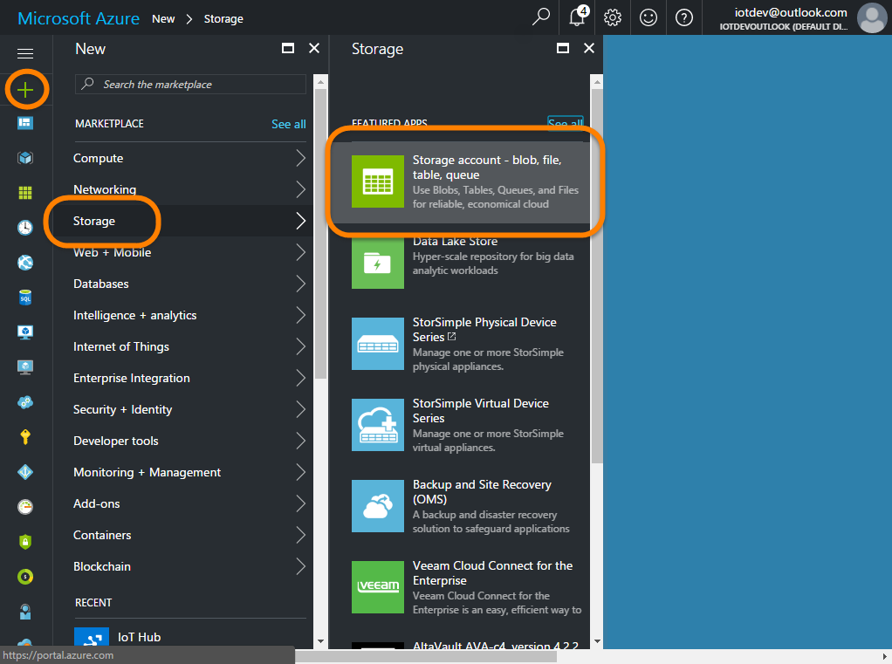
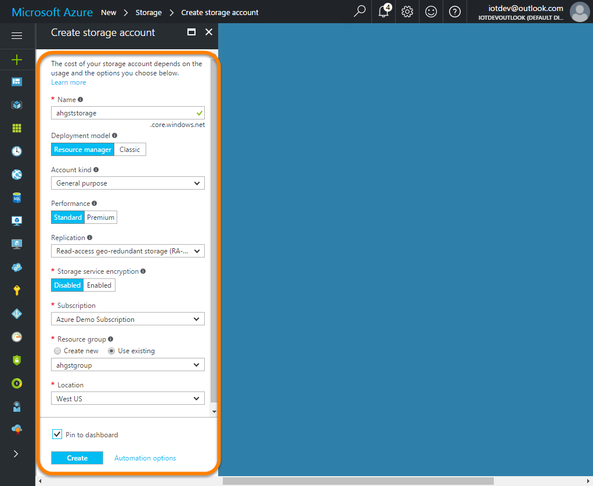
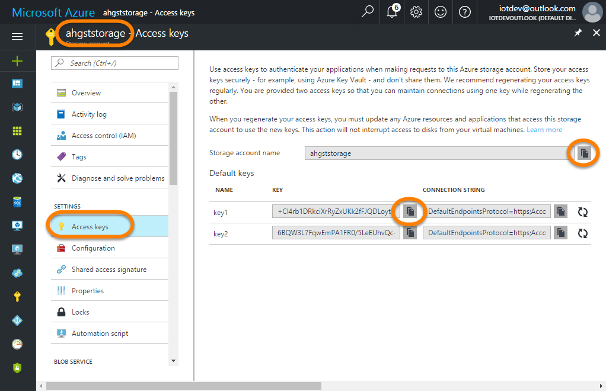

# Configure the Azure Storage Account
---

<a name="overview"></a>

## Overview

In this task you will setup the Azure Storage Account that Stream Analytics will forward sensor data to.  An Azure Storage account actually provides multiple storage services including Blob Storage, Queue Storage, File Storage and Table Storage. For this tutorial, we will only be using as single table named "**`SensorData`**" in Table Storage.

The "**`SensorData`**" table will be used to store ***all*** of valid the DHT22 sensor Temperature and Humidity readings that are received (whether or not they are alerts) for display in the web app.  We won't actually create the table here, we'll just create the storage account where the table will reside.  The table itself will be created dynamically by the Stream Analytics Job the first time it needs to actually pump data into it.

To create the Azure Storage Account, follow these steps:

1. [Create the Azure Storage Account](#step1)

---

<a name="step1"></a>

## Create the Azure Storage Account

Creating storage accounts is pretty straight forward.  In the following steps you will create the storage account.  Storage accounts have their own security model that starts with "Access keys".  Two keys, "**`key`**" and "**key2**" are created for you automatically and as with the IoT Hub SAS Policy Keys, both of the storage account keys provide the same level of access.  Having two just allows you to rotate between them, changing the old one each time to help keep them secure.  

Storage accounts also have "Connection Strings" that define the account name and account key and some protocol information in a single string, however for this tutorial all of the connection methods we'll use only need the account key and one of the keys.  We'll copy the name and "**`key1`**" key value to the "**`myresources.txt`**" file for later use.

1. With the <a target="_blank" href="https://portal.azure.com">Azure Portal</a> (<a target="_blank" href="https://portal.azure.com">https://portal.azure.com</a>) open in your browser, and the dashboard you created previously opened, click the **"+ New"** | **"Storage"** | **"Storage account - blob, file, table, queue"**:

    

1. In the "**Create storage account**" blade, complete the fields as follows and click the "**Create**" button:

    - Name: **`<name>storage`**
    - Deployment model: **Resource manager**
    - Account kind: **General purpose**
    - Performance: **Standard**
    - Replication: **Read-access geo-redundant storage (RA-GRS)**
    - Storage service encryption: **Disabled**
    - Subscription: **Choose the subscription you wish to use**
    - Resource group: **Use the existing `<name>group` group created previously**
    - Location: **Use the location you chose previously**
    - Pin to dashboard: **Checked**

    

1. Once the storage account has been created, it's blade should open in the portal (if not, open it).  Along the left, find and select "**Access keys**".  Copy the "**Storage account name**" and "**key1**" key values to the appropriate place holders in the "**`myresources.txt`**" file:

    

    Then update the appropriate place holders:

    ```text
    ...

    ========================================
    Azure Storage Resources 
    ========================================

    Azure Storage Account Name:
    <paste your Azure Storage Account Name here>

    Azure Storage Account Primary Key:
    <paste your Azure Storage Account Primary Key here>

    ...
    ```

    For example:

    ```text
    ...

    ========================================
    Azure Storage Resources 
    ========================================

    Azure Storage Account Name:
    ahgststorage

    Azure Storage Account Primary Key:
    +Cl4rb1DRkciXrRyZxUKk2fFJQDLoytI8p/UEGnjrtidgwFcEUxI+E3h5NVPsWVwkMGGMruvn5IyOpCVCPWS8Q==

    ...
    ```

That's really all there is to it.  Later on, the Stream Analytics Job will create the target "SensorData" table automatically when it starts to pump data into Table Storage.

---

<a name="sumnmary"></a>

## Summary and Next Step

In this task you created the Azure Storage account that will be used to store the SensorData received from the Azure IoT Hub by Stream Analytics.

In the next step, you will configure the event hub that will be used to forward "alert" messages.

Next Step: [Configure the Event Hub](../04-EventHub/README.md)